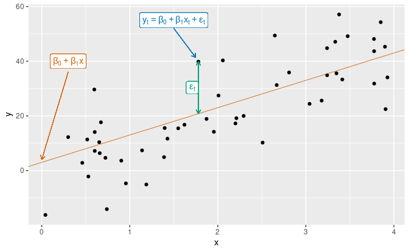

# Linear Regression

## What is Linear Regression

Linear regression is a supervised learning technique to estimate a target function under the assumption that the function output is a linear combination of the function inputs. Under these conditions, the problem of function estimation reduces to estimating the linear coefficients that define that linear combination.

In simple linear regression (SLR), the target function output is measured by a response variable $Y$ and the target function input is measured by a single a regressor $X$. Under this model, we assume the *conditional expected value* of $Y$ given a particular value $x$ of $X$ is a linear function of $x$ defined by linear coefficients $\beta_0$ and $\beta_1$ representing the intercept and slope of the regression line $\mu(x)$:

$$
\mathbb{E}(Y| X=x) = \mu (x) = \beta_0 + \beta_1 x $$

By adding more regressors and coefficients, we obtain multiple linear regression (MLR):

$$
\mathbb{E}(Y| X=x) = \mu (x) = \beta_0 + \beta_1 x_1+ \beta_2 x_2  + \dots \beta_n x_n$$

Different techniques for estimating the linear coefficients of the input features include, but are not limited to:

 - **Ordinary Least Squares (OLS)**: Minimize the residual sum of squared errors between the regression line $\mu(X)$ and the true output values
 - **Maximum Likelihood Estimation (MLE)**: Assume a joint probability distribution of output variables from linear coefficeints, and choose the linear coefficients which maximize the joint probability distribution function 
 - **Large Sample SLR**: Relax certain distributional assumptions and utilize the Law of Large Numbers to get a statisically valid regression line
 - **Ridge/Lasso Regression**: Regularization technique which minimize the residual sum of squares subject to a penalty against coefficient size

## OLS Estimators

For ease of implementation and interpretability we will procedd with Ordinary Least Squares Estimation for Simple Linear Regression. The Residual Sum of Squares (RSS) is a measure of how well the the regression line corresponding to a set of linear coefficients fits the observed data:

$$
RSS(b_0,b_1)= \sum_{i=1}^n [y_i - (b_0 + b_1 x_i)]^2$$

By taking the derative of $RSS(b_0, b_1)$ and setting it equal to $0$, we obtain our SLR OLS estimators $\hat{\beta}_0$ and $\hat{\beta}_1$:

$$
\hat{\beta}_0 = \bar{y} - \hat{\beta}_1\bar{x}$$

$$
\hat{\beta}_1 = \frac{\sum_{i=1}^n (x_i - \bar{x})(y_i - \bar{y})}{\sum_{i=1}^n (x_i-\bar{x})^2}$$

Where $\bar{x} = \frac{1}{n}\sum_{i=1}^n x_i$ and $\bar{y} = \frac{1}{n}\sum_{i=1}^n y_i$

## Further Reading

- [A Modern Approach to Regression with R](https://link.springer.com/book/10.1007/978-0-387-09608-7)