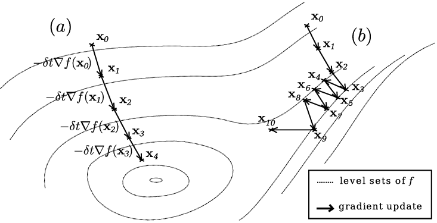
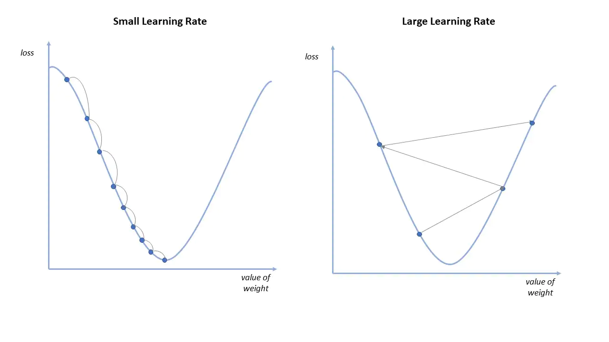

# Gradient Descent

Gradient descent is a technique to obtain a local minimum of a convex differentiable objective function. 

Assume that we want to minimize a function $f(x)$. We can visualize the function ouput as a surface lying above the function domain space. At an arbtirary starting point $x_o$ in the domain, if we were able to calculate the direction of steepest descent of the function surface, taking a small step in that direction would move towards a local minimum. Where the domain space is $\mathbb{R}$, the direction of stepest descent is given by the negative of the derivative of $f$ at $x^{0}$, denoted $-f'(x^{(0)})=\frac{df}{dx}\big\rvert_{x^{(0)}}$. Where the domain space is mulitdimensional, the direction of steepest descent generalizes to the negative gradient of $f$ evaluated at $x^{(0)}$, denoted $-\Delta f(x^{(0)})=(\frac{df}{dx_1}\big|_{x^{(0)}},\dots, \frac{df}{dx_n}\big|_{x^{(0)}})$. 

Not only does the negative gradient encode the direction of descent ascent, but its magnitude also corresponds to magitude of that maximum descent down the surface of $f$ available at point $x^{(0)}$. As the gradient approaches $0$ near a local minimum, taking a step in the direction of $-\Delta f(x_0)$ moves towards a local minimum roughly inproportion to the distance from the local minimum.

If $f(x)$ is a cost function over the paramter space for a particular supervised model, then repeatedly taking steps in the direction of steepest descent will allow us to find the paramters that minimize that cost function. In this notebook we will attempt to apply linear regression by minimizing the mean squared error as a function of the regression coefficients using gradient descent. 

## Learning rate

The learning or update rate, commonly denoted $\alpha$, is a hyperparamter of the gradient descent algorithm. After the direction of steepest descent is computed, it is scaled by $\alpha$ before the algorithm steps in that direction. If $\alpha$ is too small, then the algorithm may take longer to converge or get stuck in a local minimum near the starting point, yet far from a global minimum. If $\alpha$ is too large, then the algorithm may skip over local a local minimum, or fail to converge entirely.

## Implemention

There are two main implementations of gradient descent, both of which are implemented from scratch in the accompanying gnotebook:

**(Normal) Gradient Descent**
 - Averages the gradient of the cost function across all samples before taking a step
 - Provides a more stable convergence
 - Requires the entre dataset to be stored in memory or accessible to the algorithm

**Batch Gradient Descent**
 - Calaculates the gradient on only a random subset of samples before taking a step. If the size of the subset is 1, then this is known as stochastic gradient descent
 - The resulting path down the cost surface is noisy and less stable
 - Is more computationally efficient by only computing the gradient at a representative subset

## Further Reading

 - [Gradient Descent Algorithm - a deep dive](https://towardsdatascience.com/gradient-descent-algorithm-a-deep-dive-cf04e8115f21)