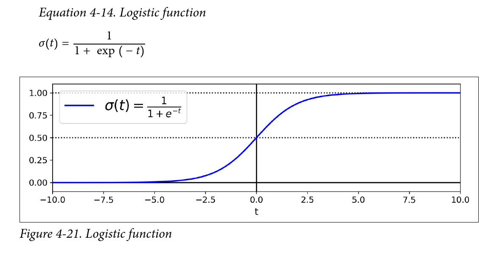
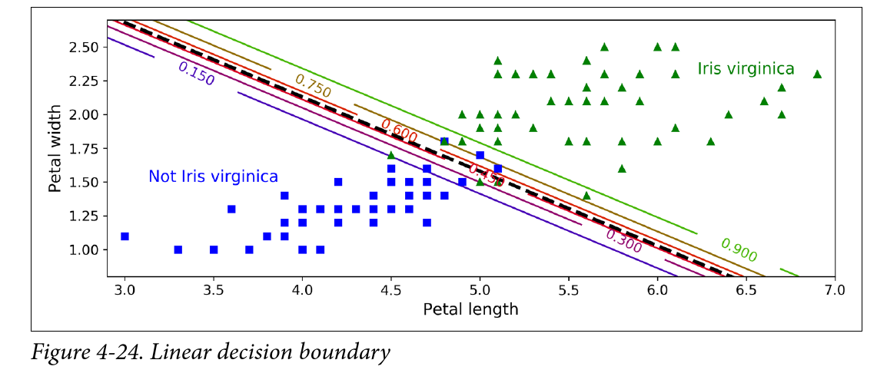

# Logistic Regression

Logistic regression estimates the probability that an instance belongs to a particular class. This can be utilized for binary classfication, where if the estimated probability is greater than 50%, then the logistic regression model predicts that the instanc ebelongs to that class, and otherwise it predicts that it does not.

Under the hood, logistic regression works similarly to linear regression by estimating the linear coefficients for a weighted sum of the input features. However, instead of outputing the estimated hyperplane, it is composed into the logisitic or sigmoid function which monotonically maps all of $\mathbb{R}$ between 0 and 1. 

If $z=\theta ^\top x$ is the linear combination of our input features, then with the logisitic transformation $\hat{p}=\sigma(z)$ we can perform model prediction as follows:

$$
\hat{y} = \begin{cases} 
    0 & \text{if }\hat{p} < 0.5 \\
    1 & \text{if }\hat{p} \geq 0.5 \\
\end{cases}$$

When $\sigma(z)=0$, this corresponds to the decision boundary where the prediction corsses between classes. When an instances features are away from one side of the decision boundary, the estimated probability of that corresponding class increases.

To find the decision boudnary which best fits the data, we seek to maximize the conditional probability of predicting the correct label from the logistic model across every sample instance. For a single instance, the probability of predicting the correct class can be written as follows:

$$
P\Big(y^{(i)}\mid x^{(i)}\Big)=\begin{cases}
          \hat{p}^{(i)}, \quad &  y^{(i)} = 1 \\
          1-\hat{p}^{(i)}, \quad & y^{(i)} = 0 \\
     \end{cases}$$

By applying Bernoulli's distribution, averaging across all instances, and taking the negative log, we arrive at the Binary Cross Entropy Loss Function.

$$
L(\mathbf{w}, b) = -\frac{1}{N} \sum_{i=1}^{N} P\Big(y^{(i)}\mid x^{(i)}\Big) = \frac{1}{N}\sum_{i=1}^{N}\Big[ -y^{(i)}\log \hat{p}^{(i)} - (1-y^{(i)}) \log (1 - \hat{p}^{(i)})\Big ]
$$

Note that $L$ is convex and differentiable, so that it can be minimized using gradient descent.

## Further Reading

- [Logistic Regression - Detailed Overview](https://towardsdatascience.com/logistic-regression-detailed-overview-46c4da4303bc)