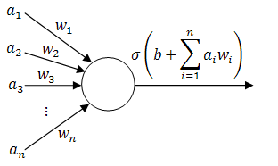

# Neural Networks

Neural networks are complex parameterized models inspired by the way biological neurons process information. These highly versatile models are used in tasks as diverse as image classification and segmentation, natural language processing, and recomendation engines. 

Neural networks are modeled through a directed graph of individual nodes. Initially, feature data is passed in to the input layer of nodes. Subsequent nodes in the graph recieve the output from previous nodes as input, and combine them using a parameterized function. Then the combination of inputs is passed into an activation function before being output to the layer of nodes. Collections of intermediate nodes are called hidden layers, and terminal nodes in the graph are known as the output layer.

If the combination function and activation function of each node are differentiable, then the contribution of each model parameter to a loss function between the output activations and true labels can be computed. The process of updating these parameters utilizing the computed gradient of the loss function is known as backpropgration, and it provides a means to train a neural network.

Types of Neural Networks include:

- **Feedforward Neural Networks** An artificial neural network whose node connections can be modelled in an acyclic graph
  - **Single-Layer Perceptrons** A feedforward neural network consisting only of an input layer and an output layer, with no hidden layers in between
    
  - **Multi-Layer Perceptirons** A feedforward neural network featuring at least one hidden layer. Nodes usually utilize a sigmoid activation function, and these networks are able to learn non-linear representations.
    
- **Convolutional Neural Networks (CNNs)** are similar to feedforward networks, but they’re usually utilized for image recognition, pattern recognition, and/or computer vision. These networks harness principles from linear algebra, particularly matrix multiplication, to identify patterns within an image.
  
- **Recurrent Neural Networks (RNNs)** are identified by their feedback loops. These learning algorithms are primarily leveraged when using time-series data to make predictions about future outcomes, such as stock market predictions or sales forecasting.

## Further Resources

- [3Blue1Browns excellent visualization and explanation of backpropogration and neural network training](https://www.youtube.com/watch?v=Ilg3gGewQ5U)
- [An introductory Towards Data Science article on Neural Networks](https://towardsdatascience.com/a-gentle-introduction-to-neural-networks-series-part-1-2b90b87795bc)