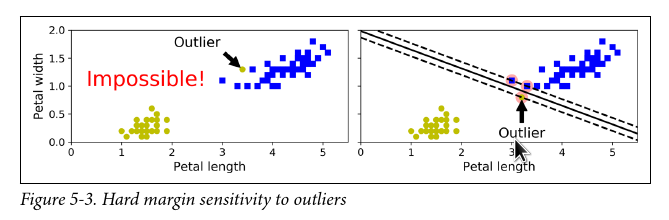
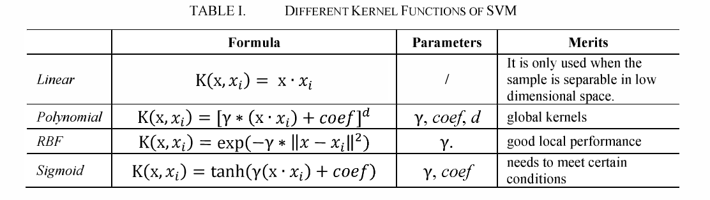

# Support Vector Machines

Support vector machines (SVMs) are a type of supervised machine learning algorithm that can be used for classification or regression. The idea behind SVMs is to find the best boundary or decision surface that separates the different classes. In $n$-dimensional feature space this boundary is a hyperplane, and the goal is to find the hyperplane that has the largest margin, which is the distance between the closest points in each class and the hyperplane itself. Once the hyperplane is found, new data can be classified by simply checking which side of the hyperplane it falls on.

## Hard vs Soft Margin Classification

If all the examples in the training set must be correctly classified by the resulting hyperplane, this is known as **hard margin classification**. It allows for no errors or missclassifications, and thus is prone to overfitting, especially when the dataset is not linearly seperable.

To avoid these issues, we can use a more flexible model know as **soft margin classification**, which seeks to find a hyperplane that maximizes the margin while allowing for some misclassifications. This is done by introducing a regularization parameter $C$ that controls the trade-off between maximizing the margin and allowing for misclassifications. The regularization parameter can be adjusted to find the balance that works best for the given dataset.

## SVM Primal Formulation

The soft margin SVM problem is given by the following quadratic programming formulation:

$$
\begin{aligned}
& \min_{w, b, \zeta} && \frac{1}{2} w^\top w + C \sum_{i=1}^n \zeta_i \\
& \text{s.t.} && y_i(w \cdot x_i + b) \ge 1 - \zeta_i, && i = 1, \ldots, n \\
&&& \zeta_i \ge 0, && i = 1, \ldots, n
\end{aligned}
$$

In this formulation, $w$ and $b$ are the parameters of the hyperplane, $C$ is the regularization parameter, $x_i$ and $y_i\in\{-1,1\}$ are the input and output (respectively) of the $i$th example in the training set, and $\zeta_i$ is the slack variable for the $i$th example. The objective function seeks to minimize the squared norm of $w$ (to maximize the margin) while also allowing for some misclassifications, controlled by the regularization parameter $C$ and the slack variables $\zeta_i$. The constraints ensure that the hyperplane correctly classifies the examples in the training set, up to a tolerance controlled by the slack variables $\zeta_i$.

Given an optimal solution $(\hat{w}, \hat{b})$, the SVM model makes a prediction as follows:

$$\hat{y} =\begin{cases}
    0 & \text{if } \hat{w}^\top b <0 \\
    1 & \text{if } \hat{w}^\top b \geq 0 
\end{cases}$$

## Kernelized SVM

Kernelized SVM allows for non-linear decision boundaries by using a kernel function to map the input examples into a higher-dimensional space, where they may be linearly separable. This allows for non-linear decision boundaries, which can be more effective in some cases.

Some examples of popular kernel functions are as follows:

## SVM Dual Formulation

By utilizing the dual quadratic programming formulation of the SVM problem, we can exploit the kernel trick to map the input examples into a higher-dimensional space implicitly, without the need to compute the explicit feature maps.

$$
\begin{aligned}
& \min_{\alpha} && \frac{1}{2} \sum_{i=1}^n \sum_{j=1}^n \alpha_i \alpha_j y_i y_j K(x_i, x_j) - \sum_{i=1}^n \alpha_i \\
& \text{s.t.} && 0 \le \alpha_i \le C, && i = 1, \ldots, n \\
&&& \sum_{i=1}^n \alpha_i y_i = 0
\end{aligned}$$

In this formulation, $\alpha_i$ are the dual variables, $C$ is the regularization parameter, $x_i$ and $y_i\in\{-1,1\}$ are the input and output (respectively) of the $i$th example in the training set, and $K(x_i, x_j)$ is the kernel function that measures the similarity between the $i$th and $j$th examples. 

The objective function seeks to maximize the sum of the dual variables less a sum across pairwine kernel combinations. The first constraint ensures that the dual variables are non-negative and bounded by $C$. The second constraint ensures that the sum of the dual variables weighted by the outputs is zero. The resulting optimal dual variables can then be used to compute the parameters of the hyperplane as follows. 

Let $S =\{i \in 1,2,\dots,m\ : \hat{\alpha}_i > 0\}$ be the  index set of support vectors and put $n_S=|S|$.

First compute the bias term $\hat{b}$:

$$
\hat{b} = \frac{1}{n_S} \sum_{i\in S} \bigg(y^{(i)} - \sum_{j\in S} \hat{\alpha}^{(j)} y^{(j)} K\big(x^{i}, x^{j} \big) \bigg)$$

Then a prediction $\hat{y}$ for input $x$ is given by:

$$

\hat{y} = \sum_{i\in S} \hat{\alpha}^{(i)} y^{(i)} K\big(x^{i}, x \big) + \hat{b}$$

## Further Reading

- [Support Vector Machines](https://towardsdatascience.com/support-vector-machine-introduction-to-machine-learning-algorithms-934a444fca47)