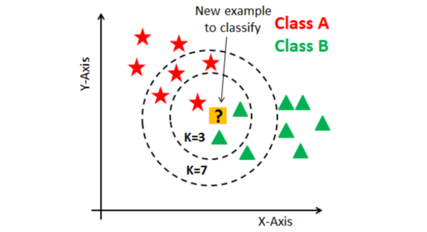

# K Nearest Neighbors

K nearest neighbors (KNN) is a machine learning algorithm that is used for classification and regression. In classification, the algorithm predicts the label of a new data point based on the labels of the closest data points in the training set. In regression, the algorithm predicts the value of a new data point based on the values of the closest data points in the training set. The "k" in KNN refers to the number of nearest neighbors that the algorithm considers when making a prediction.

KNN is a non-parametric algorithm, meaning it does not make any assumptions about the underlying data. This can make it quite flexible to datasets with a complex structure or that are not linearly seperable. However, it does incurr a high runtime during prediction by checking the distance to every training example.

## Picking K

While KNN is quite easy to implement, picking an optimal hyperparameter $k$ is critical to model performance. If $k$ is too large, then prediction may be unable to pick up on local trends in the feature space. Alternatively if $k$ is too small, then prediction can become sensitive to overfitting towards outliers. Additional, under classification it is best if $k$ is odd so that the major vote is well defined.

## Further Reading:

- [Introduction to K Nearest Neighbors](https://ai.plainenglish.io/introduction-to-k-nearest-neighbors-knn-algorithm-e8617a448fa8)