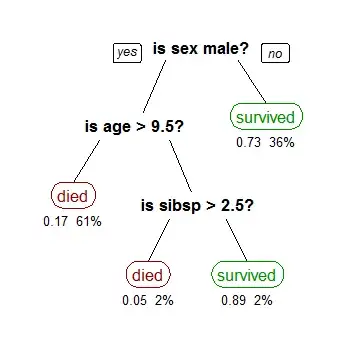

# Decision Trees

A decision tree is a binary tree structure used to process feature vectors for classification or regression according to a collection of decision rules. These decision rules are derived from the features of the training data. These rules are then used to split the data into distinct groups, which results in the creation of the branches of the tree. 

All feature vectors processed by the tree start at the root node. At every internal node of the tree, the feature vector in question will progress on a branch down to either the left or right child depending on if it satisifes the decision rule of the current node or not. When the feature vector reaches a leaf node, a prediction can be made based upon the output variables of training examples that terminated at that node. For classification, we take the majority vote of output labels, and for regression, we take the average of output values.

## Growing the Tree

We use the greedy **Classification and Regression Tree (CART)** algorithm to train or "grow" the decision tree. Starting at the root node, we wish to pick the decision rule which minimizes the following cost function:

$$
J(k, t_k) = \frac{m_\text{L}}{m} G_{\text{L}} + \frac{m_\text{R}}{m} G_{\text{R}}$$

where
 - $(k, t_k)\in\{1,\dots, n\}\times \mathbb R$ is a feature and threshold pair representing the split or decision rule $x_k \leq t_k$
 - $m$ is the number of training samples
 - $m_L = |\{x^(i) : x_k^{(i)} \leq t_k \}|$
 - $m_R = |\{x^(i) : x_k^{(i)} > t_k \}|$
 - $G_L$ is a measure of impurity of $\{y^(i) : x_k^{(i)} \leq t_k \}$
 - $G_R$ is a measure of impurity of $\{y^(i) : x_k^{(i)} > t_k \}$

There are different measures of impurity, including
- **Gini Coefficient**: Measures how often a randomly chosen element would be incorrectly identified. For $k$ classes, the Gini coefficient of a set $X$ is given by:

$$G(X) = 1- \sum _{i=1} ^k P(\text{selecting class } k \text{ from } X) ^2$$

- **Entropy / Information Gain** Measures the randomness or uncertainly of a random variable. Entropy is 0 if all nodes are the same class, and positive in the presence of multiple classes. Thus if we use entropy as our measure of impurity, we must instead minimize the above cost function.

## Prevent overfitting

If left to split nodes until all leaf nodes are monolithic, then the CART algorithm will likely yeild results which are overfit to the training data. To avoid this, there are a number of parameters we can tune:

- The max depth of the tree
- The minimum number of samples to split a node
- The minimum number of samples of a leaf

## Further Reading

- [Decision Trees in Machine Learning](https://towardsdatascience.com/decision-trees-in-machine-learning-641b9c4e8052)
- [Decision Trees in Scikit Learn](https://scikit-learn.org/stable/modules/tree.html)