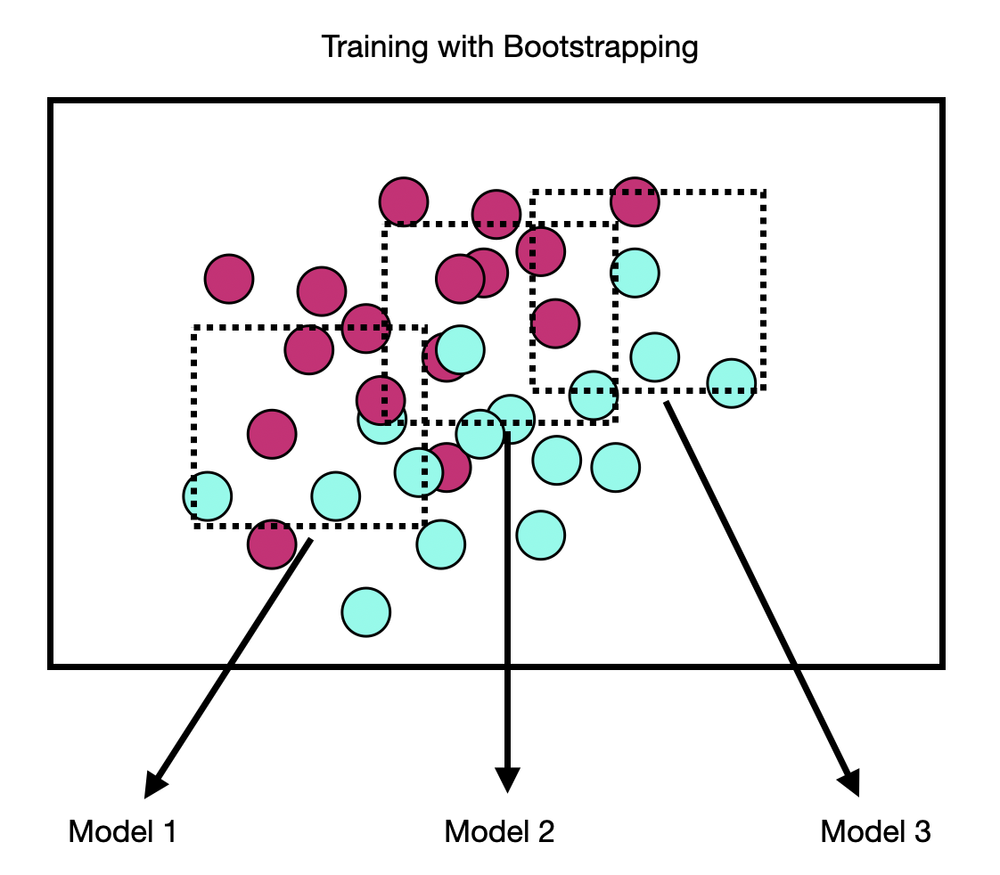

# Ensemble Learning

Ensemble learning is a machine learning technique where multiple models are trained and their predictions are combined to make more accurate predictions than any individual model could make. This is often done by training several models on the same data and then combining their predictions using a voting system, where each model gets a "vote" on the final prediction, or by using a more complex combination such as averaging the predictions of all the models. Ensemble learning can be used for both classification and regression tasks.

Examples of emseble methods include Bagging and Random Forrests

## Bagging

Bagging, short for Bootstrap Aggregation, is a technique developed by Leo Breiman, with the goal of reducing the variance of a learning model. Bagging is also model agnostic, so regardless of type of model you’re using, the process is the same.

The Bootstrapping part of Bagging refers to the resampling method in which several random samples are drawn with replacement from a dataset. As a consequence, Bootstrapping creates multiple, smaller random datasets drawn from the same distribution.

Each of the bootstrapped datasets is used to train a model, and the outputs are then Aggregated into one final result. Since each model is trained on its own dataset, each model makes different mistakes with a distinct error and variance. By aggregating the results of all models, the distinct errors are averaged out resulting in a lower total variance than any one individual model could obtain.

## Random Forests

Random Forests was developed specifically to address the problem of high-variance in Decision Trees. Like the name suggests, you’re not training a single Decision Tree, you’re training an entire forest! In this case, a forest of Bagged Decision Trees.

The random forrest algorithm works as follows:

 - Create $N$ bootstrapped datasets from the originla dataset
 - For each of the $N$ bootstrapped datasets, train a decision tree using only that dataset and a subset of the original features.
 - Aggregate the reults of all decision trees into a single predictor
   - For regression, average the outputs
   - For classification, take the majority vote

The random sampling of both examples and features helps to ensure the independent errors and variance for each model.

## Further Reading

[Random Forests Algorithm Explained](https://towardsdatascience.com/random-forests-algorithm-explained-with-a-real-life-example-and-some-python-code-affbfa5a942c)