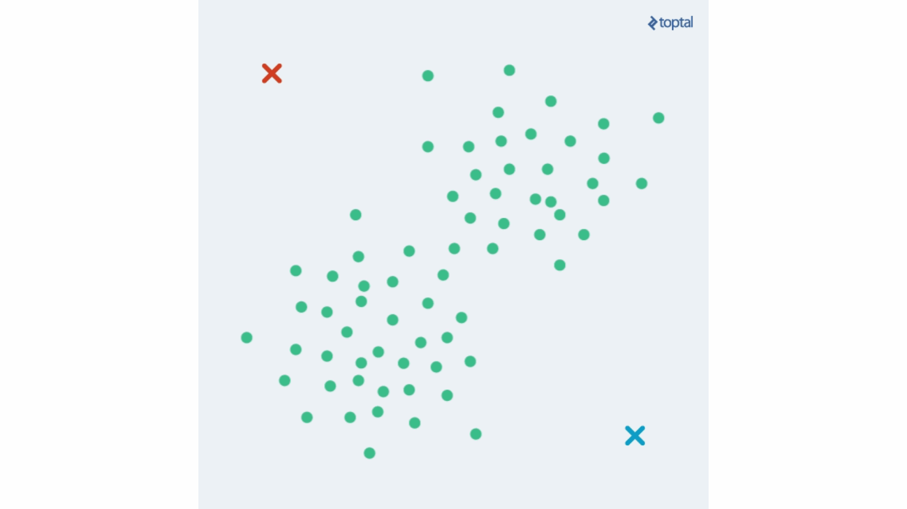

# K Means Clustering

K-means clustering is a type of unsupervised machine learning algorithm that is used for clustering data into groups (or clusters) based on the similarity of the data points. The algorithm works by iteratively assigning each data point to the cluster with the nearest mean (or centroid), and then updating the cluster centroids based on the new assignments. This process continues until the cluster assignments stop changing or a predetermined number of iterations have been reached. The goal of k-means clustering is to partition the data into clusters in a way that minimizes the within-cluster variation (i.e., the sum of the squared distances between each data point and the centroid of its cluster).

## Further Reading

 - [Understanding K-means Clustering in Machine Learning](https://towardsdatascience.com/understanding-k-means-clustering-in-machine-learning-6a6e67336aa1)
 - [K-Means Clustering from Scratch](https://pub.towardsai.net/k-means-clustering-from-scratch-4e357ac4716f)