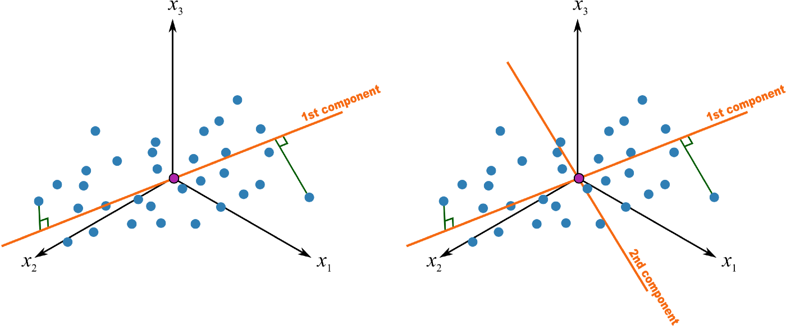

# Principal Component Analysis

Principle Component Analysis (PCA) is a statistical technique used to reduce the dimensionality of data. It does this by identifying the directions in which the data varies the most, and then projecting the data onto a lower-dimensional subspace along these directions.

## Implementation

Assume that $X\in \mathbb{R}^{(m\times n)}$ is a standardized data matrix. We can compute the covariance matrix of $X$, which is a square matrix that contains the pairwise covariances between the features. The covariance matrix is given by the following equation:

$$S = \frac{1}{n-1}X^TX$$

In particular, we want to identify eigenvectors of this covariance matrix $C$. This can be accompolished with the singular value decomposition of $X$:

$$X = U \Sigma V^T$$$$

where $U\in\mathbb{R}^{(m\times n)}$ is a matrix containing the left singular vectors, $\Sigma\in\mathbb{R}^{(n \times n)}$ is a diagonal matrix containing the singular values, and $V^\top\in\mathbb{R}^{(n\times n)}$ is the transpose of the matrix containing the right singular vectors. For the purposes of PCA, the resulting princple components can be found in the columns of $V$.

## Reprojecting Data

Let $\bar{V}\in\mathbb{R}^{(n\times k)}$ be a obtained by selecting a subset of the columns of $V$. Then the examples in $X$ can be projected down to  $\mathbb{R}^k$ by the following transformation

$$X' = X \bar{V}$$

## Explained Variance

The $i$-th principle component explains 

$$
\frac{\sigma_{i}^{2}/(n-1)}{T} = \frac{\sigma_{i}^{2}}{\sigma_{1}^{2} + \dots + \sigma_{m}^{2}}
$$

of the total variation, where the diagonal elements of $\Sigma$ are the squared eigenvalues $\sigma_1^2,\dots,\sigma_m^2$. Furthermore, $\sigma_i^2$ is the sum of square distances from the points projected to the $i$-th principle component to the origin.

## Further Reading

- [A One Stop Shop For PCA](https://towardsdatascience.com/a-one-stop-shop-for-principal-component-analysis-5582fb7e0a9c)